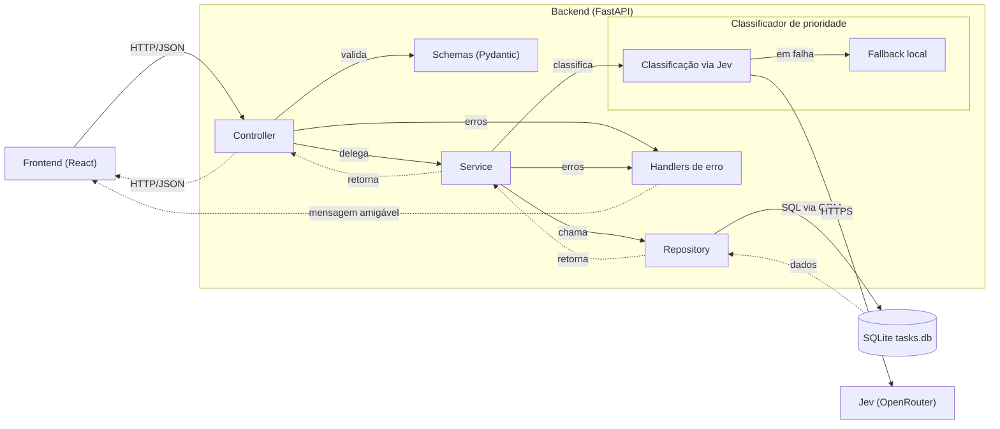
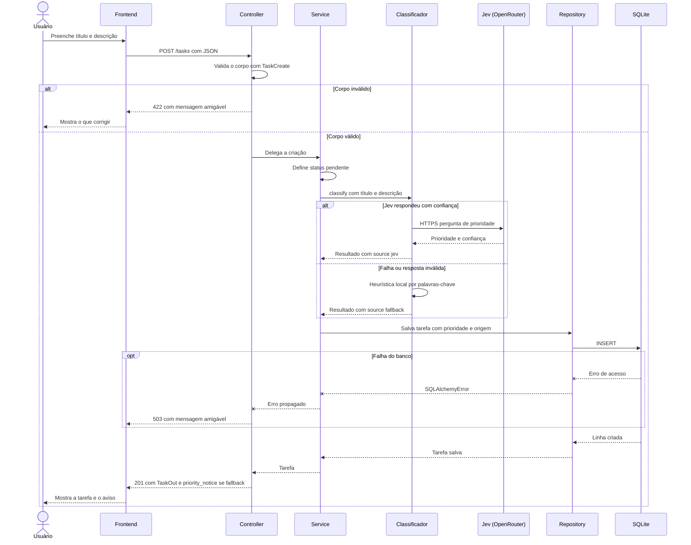
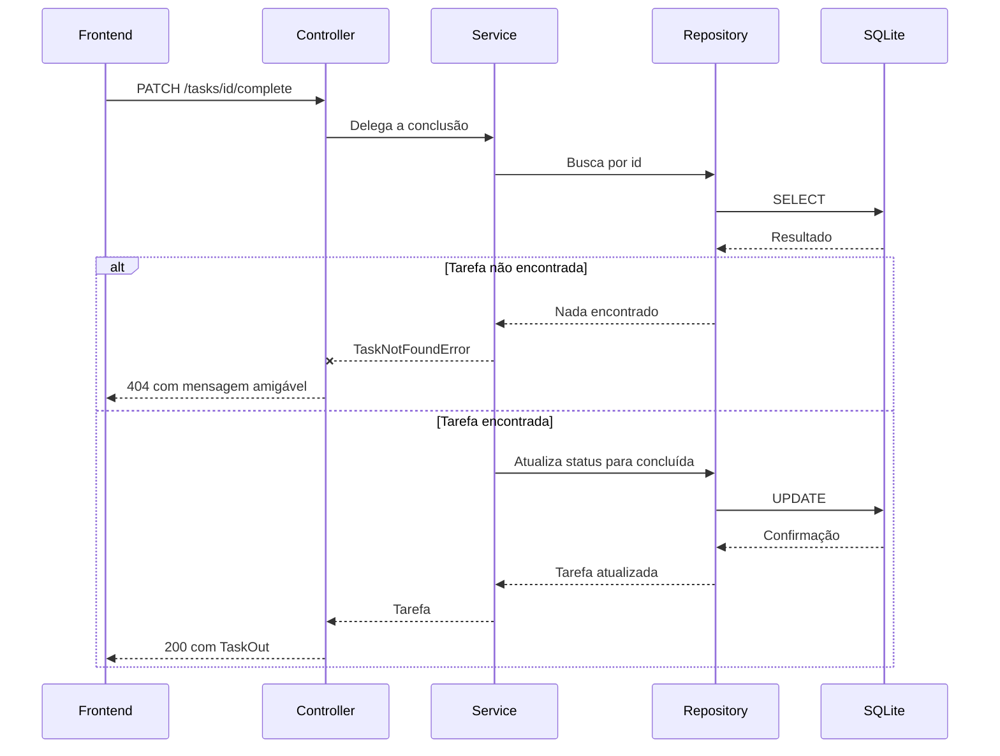
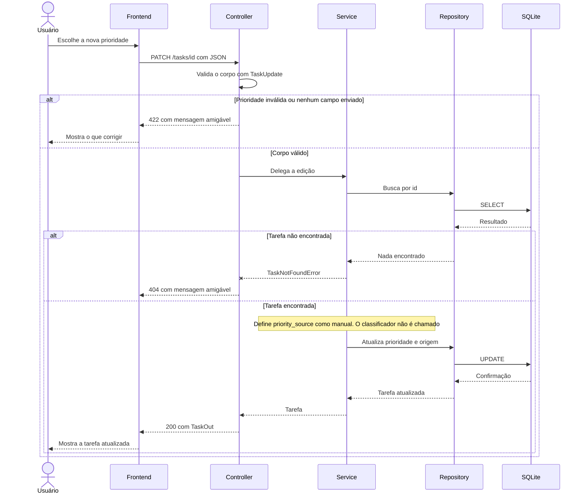

# Arquitetura

Visão da Micro-API de tarefas. As rotas, o service e o repository ainda não foram implementados; os diagramas descrevem o desenho alvo.

## Tarefa e endpoints

| Campo | Tipo | Observação |
|---|---|---|
| `id` | inteiro | gerado pelo banco |
| `title` | texto | 1 a 100 caracteres |
| `description` | texto ou nulo | até 500 caracteres |
| `status` | `pendente` ou `concluida` | inicial: `pendente` |
| `priority` | `baixa`, `media` ou `alta` | automática na criação |
| `priority_source` | `jev`, `fallback` ou `manual` | muda para `manual` ao editar a prioridade |
| `created_at` | data e hora | gerado pelo banco |

| Método e rota | Função |
|---|---|
| `POST /tasks` | criar tarefa |
| `GET /tasks?status=pendente` | listar com filtro opcional por status |
| `GET /tasks/{id}` | detalhar |
| `PATCH /tasks/{id}` | editar campos e prioridade |
| `PATCH /tasks/{id}/complete` | marcar como concluída |
| `DELETE /tasks/{id}` | remover |

## Diagrama 1: Componentes

Mostra as camadas do backend, o classificador com fallback local, os handlers de erro e os sistemas externos.

## Diagrama 2: Criar tarefa

Mostra `POST /tasks`, com validação, classificação de prioridade (Jev ou fallback) e falha do banco.

## Diagrama 3: Concluir tarefa

Mostra `PATCH /tasks/{id}/complete`, com o caso de tarefa não encontrada.

## Diagrama 4: Editar a prioridade

Mostra `PATCH /tasks/{id}` com prioridade manual, que nunca é sobrescrita pelo classificador.

