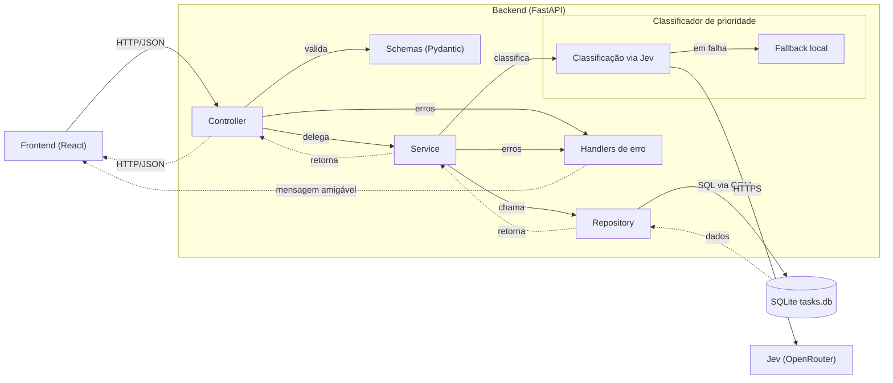
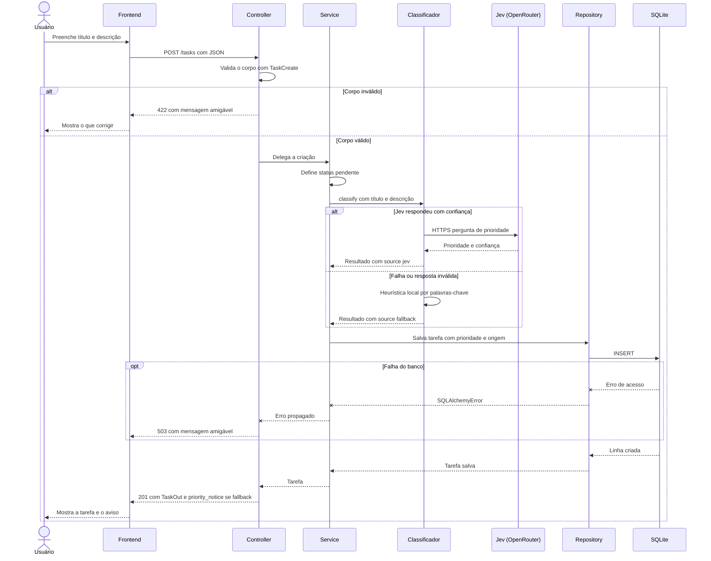
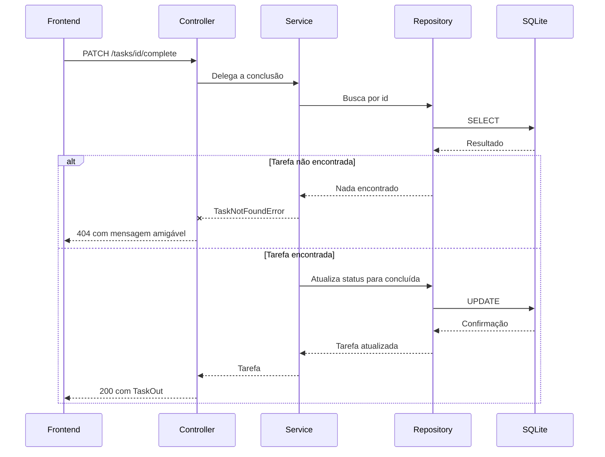
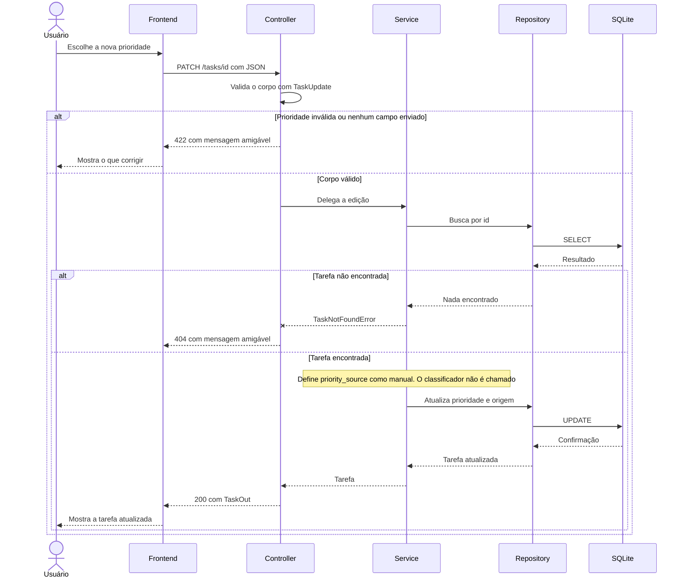

# Micro-API To-Do — Plano de Implementação

> **For agentic workers:** REQUIRED SUB-SKILL: Use superpowers:subagent-driven-development (recommended) or superpowers:executing-plans to implement this plan task-by-task. Steps use checkbox (`- [ ]`) syntax for tracking.

**Goal:** Entregar dependências, configuração, schemas Pydantic, tratamento amigável de erros, classificador de prioridade (Jev com fallback), testes, documentação, README e CI da Micro-API To-Do.

**Architecture:** Componentes independentes em `app/` (schemas, config, erros, classificador) que o service e o `main.py` usarão em um ciclo posterior. O classificador chama o Jev por `httpx` e nunca levanta exceção; os handlers convertem qualquer falha em JSON amigável em português.

**Tech Stack:** Python 3.12, FastAPI, Pydantic v2, pydantic-settings, SQLAlchemy 2.x (só para tipar `SQLAlchemyError`), httpx, pytest, ruff, black, mypy.

**Spec:** `docs/superpowers/specs/2026-10-04-todo-api-design.md` (fonte dos requisitos originais: `spec_inicial.txt`).

## Global Constraints

- Python `>=3.12,<3.13`; `.python-version` = `3.12`.
- Versões fixadas com `==`, sem dependências transitivas, sem lockfile, sem driver de banco, sem SDK de IA.
- Pydantic v2 apenas (`ConfigDict`, `field_validator`, `model_validator`, `computed_field`); `str | None`, nunca `Optional`.
- Docstrings em português, estilo Google, em módulos, classes e funções públicas; nos schemas, uma linha por classe.
- Mensagens ao usuário só em português do Brasil, sem jargão, sem stack trace, nome de exceção, SQL, caminho de arquivo, nem mensagem em inglês do framework.
- Nunca registrar em log a chave de API, o título nem a descrição.
- Jev: `POST {base_url}/v1/systemone`, modelo padrão `typesafe/jev-1.13`, `openrouter_base_url = "https://openrouter.ai/api"`.
- Testes sem rede. Cobertura mínima de 90% em `app/services/priority_classifier.py` e `app/core/errors.py`.
- Commits pequenos, Conventional Commits em português, com o trailer `Co-Authored-By: Claude Sonnet 5.5 <noreply@anthropic.com>`. Sem push.
- Fora do escopo: rotas, models ORM, services, repositories, `app/main.py`, frontend, autenticação, cache, filas, Docker, deploy, testes de integração.
- Cada chamada de shell é nova: use `.venv/bin/<comando>` em vez de `source .venv/bin/activate`.

## Review Focus

1. `OPENROUTER_API_KEY=` vazio no `.env` (string vazia) deve contar como chave ausente: fallback, sem requisição. (Task 6)
2. Palavras-chave em maiúsculas ou acentuadas (`URGENTE`, `PRODUÇÃO`) devem acionar a heurística. (Task 6)
3. Título com 100 caracteres e espaços nas pontas é aceito (e fica sem os espaços); com 101 caracteres úteis é rejeitado. (Task 4)
4. Resposta 200 com JSON válido mas sem `answers.priority` deve virar fallback, não erro. (Task 6)
5. Corpo da requisição com JSON malformado deve gerar 422 amigável, nunca 500. (Task 5)

---

### Task 1: Dependências

**Files:**
- Create: `requirements.txt`
- Create: `requirements-dev.txt`

**Interfaces:**
- Produces: ambiente `.venv` com todas as dependências instaladas, usado por todas as tarefas seguintes.

- [ ] **Step 1: Reconferir as versões no PyPI** (as do spec são de 2026-10-02)

```bash
for p in fastapi uvicorn sqlalchemy alembic pydantic pydantic-settings python-dotenv httpx pytest pytest-cov ruff black mypy; do echo -n "$p "; curl -s https://pypi.org/pypi/$p/json | python3 -c "import sys,json;print(json.load(sys.stdin)['info']['version'])"; done
```
Expected: versões iguais às do Step 2. Se alguma mudou, use a nova e registre no relatório final.

- [ ] **Step 2: Criar `requirements.txt`**

```text
# Web
fastapi==0.142.2
uvicorn[standard]==0.54.0

# Banco de dados
alembic==1.20.0
sqlalchemy==2.1.2

# Cliente HTTP
httpx==0.28.1

# Validação e configuração
pydantic==2.13.5
pydantic-settings==2.15.0
python-dotenv==1.2.4
```

- [ ] **Step 3: Criar `requirements-dev.txt`**

```text
-r requirements.txt

# Testes
pytest==9.1.1
pytest-cov==7.1.0

# Qualidade de código
black==26.5.1
mypy==2.4.0
ruff==0.16.10
```

- [ ] **Step 4: Criar o venv e instalar**

```bash
python3.12 -m venv .venv && .venv/bin/pip install -r requirements-dev.txt
```
Expected: instalação sem conflitos. Se o resolvedor reclamar, ajuste a versão conflitante, reinstale e registre a mudança.

- [ ] **Step 5: Verificar**

```bash
.venv/bin/python --version
.venv/bin/pip check
.venv/bin/python -c "import fastapi, sqlalchemy, pydantic, httpx, sqlite3"
.venv/bin/python -c "import sqlalchemy as sa; e = sa.create_engine('sqlite:///:memory:'); print(e.connect().execute(sa.text('select 1')).scalar())"
```
Expected: `Python 3.12.x`, `No broken requirements found.`, sem saída no import, `1`. Guarde as saídas literais para o relatório.

- [ ] **Step 6: Commit**

```bash
git add requirements.txt requirements-dev.txt
git commit -m "chore: adiciona dependências de produção e desenvolvimento" -m "Co-Authored-By: Claude Sonnet 5.5 <noreply@anthropic.com>"
```

---

### Task 2: Versão do Python e configuração das ferramentas

**Files:**
- Create: `.python-version`
- Create: `pyproject.toml`

**Interfaces:**
- Produces: `pytest` com `pythonpath = ["."]` (permite `import app...`), `ruff` com regras `D` (Google), `black` e `mypy` em modo estrito.

- [ ] **Step 1: Criar `.python-version`**

```text
3.12
```

- [ ] **Step 2: Criar `pyproject.toml`**

```toml
[project]
name = "ufg-todo"
version = "0.1.0"
description = "Micro-API de tarefas com prioridade automática"
requires-python = ">=3.12,<3.13"

[tool.black]
line-length = 100
target-version = ["py312"]

[tool.ruff]
line-length = 100
target-version = "py312"

[tool.ruff.lint]
select = ["E", "F", "I", "UP", "B", "D"]

[tool.ruff.lint.pydocstyle]
convention = "google"

[tool.ruff.lint.per-file-ignores]
"tests/**" = ["D"]

[tool.mypy]
python_version = "3.12"
strict = true
plugins = ["pydantic.mypy"]

[tool.pytest.ini_options]
testpaths = ["tests"]
pythonpath = ["."]
```

- [ ] **Step 3: Verificar que as ferramentas leem a configuração**

```bash
.venv/bin/ruff check . --exclude .venv
.venv/bin/black --check . --exclude '/(\.venv)/'
.venv/bin/pytest
```
Expected: `ruff` e `black` passam (só há arquivos de configuração); `pytest` termina com "no tests ran" (código 5), que é esperado agora.

- [ ] **Step 4: Commit**

```bash
git add .python-version pyproject.toml
git commit -m "chore: fixa versão do Python e configura ferramentas de qualidade" -m "Co-Authored-By: Claude Sonnet 5.5 <noreply@anthropic.com>"
```

---

### Task 3: Configuração do classificador

**Files:**
- Create: `app/__init__.py`
- Create: `app/core/__init__.py`
- Create: `app/schemas/__init__.py`
- Create: `app/services/__init__.py`
- Create: `app/core/config.py`
- Create: `.env.example`
- Test: `tests/test_config.py`

**Interfaces:**
- Produces: `Settings` (campos abaixo) e `get_settings() -> Settings`.

- [ ] **Step 1: Criar os pacotes** (cada `__init__.py` com uma docstring)

`app/__init__.py`: `"""Micro-API de tarefas."""`
`app/core/__init__.py`: `"""Configuração e tratamento de erros."""`
`app/schemas/__init__.py`: `"""Schemas Pydantic da API."""`
`app/services/__init__.py`: `"""Serviços e componentes de negócio."""`

- [ ] **Step 2: Escrever o teste que falha** — `tests/test_config.py`

```python
from pydantic import SecretStr

from app.core.config import Settings


def test_valores_padrao() -> None:
    settings = Settings(_env_file=None, openrouter_api_key=None)
    assert settings.openrouter_api_key is None
    assert settings.openrouter_base_url == "https://openrouter.ai/api"
    assert settings.jev_model == "typesafe/jev-1.13"
    assert settings.classifier_timeout_seconds == 5.0
    assert settings.classifier_max_retries == 1
    assert settings.jev_min_confidence == 0.5


def test_le_variaveis_de_ambiente(monkeypatch) -> None:
    monkeypatch.setenv("OPENROUTER_API_KEY", "chave-teste")
    monkeypatch.setenv("JEV_MODEL", "typesafe/jev-latest")
    settings = Settings(_env_file=None)
    assert isinstance(settings.openrouter_api_key, SecretStr)
    assert settings.openrouter_api_key.get_secret_value() == "chave-teste"
    assert settings.jev_model == "typesafe/jev-latest"


def test_chave_nao_aparece_na_representacao() -> None:
    settings = Settings(_env_file=None, openrouter_api_key="chave-teste")
    assert "chave-teste" not in repr(settings)
```

- [ ] **Step 3: Rodar e ver falhar**

Run: `.venv/bin/pytest tests/test_config.py -v`
Expected: FAIL com `ModuleNotFoundError: app.core.config`.

- [ ] **Step 4: Implementar** — `app/core/config.py`

```python
"""Configurações da aplicação lidas de variáveis de ambiente e do arquivo `.env`."""

from functools import lru_cache

from pydantic import SecretStr
from pydantic_settings import BaseSettings, SettingsConfigDict


class Settings(BaseSettings):
    """Configurações do classificador de prioridade."""

    model_config = SettingsConfigDict(env_file=".env", env_file_encoding="utf-8", extra="ignore")

    openrouter_api_key: SecretStr | None = None
    openrouter_base_url: str = "https://openrouter.ai/api"
    jev_model: str = "typesafe/jev-1.13"
    classifier_timeout_seconds: float = 5.0
    classifier_max_retries: int = 1
    jev_min_confidence: float = 0.5


@lru_cache
def get_settings() -> Settings:
    """Devolve as configurações, lidas uma única vez por processo."""
    return Settings()
```

- [ ] **Step 5: Criar `.env.example`**

```dotenv
# Chave do OpenRouter (opcional). Sem ela, a prioridade usa o fallback local.
OPENROUTER_API_KEY=
OPENROUTER_BASE_URL=https://openrouter.ai/api
JEV_MODEL=typesafe/jev-1.13
CLASSIFIER_TIMEOUT_SECONDS=5.0
CLASSIFIER_MAX_RETRIES=1
JEV_MIN_CONFIDENCE=0.5
```

- [ ] **Step 6: Rodar e ver passar**

Run: `.venv/bin/pytest tests/test_config.py -v && .venv/bin/ruff check app tests && .venv/bin/mypy app`
Expected: 3 passed; `ruff` e `mypy` limpos.

- [ ] **Step 7: Commit**

```bash
git add app tests/test_config.py .env.example
git commit -m "feat: adiciona configurações do classificador" -m "Co-Authored-By: Claude Sonnet 5.5 <noreply@anthropic.com>"
```

---

### Task 4: Schemas Pydantic

**Files:**
- Create: `app/schemas/task.py`
- Test: `tests/test_schemas.py` (arquivo adicional ao spec original, para cobrir os schemas com TDD)

**Interfaces:**
- Produces: `TaskStatus`, `TaskPriority`, `PrioritySource` (`StrEnum`), `TaskCreate(title, description)`, `TaskUpdate(title, description, status, priority)`, `TaskOut(...)` com `priority_notice`, e a constante `PRIORITY_FALLBACK_NOTICE`.

- [ ] **Step 1: Escrever os testes que falham** — `tests/test_schemas.py`

```python
from datetime import datetime
from types import SimpleNamespace

import pytest
from pydantic import ValidationError

from app.schemas.task import (
    PRIORITY_FALLBACK_NOTICE,
    PrioritySource,
    TaskCreate,
    TaskOut,
    TaskPriority,
    TaskStatus,
    TaskUpdate,
)


def test_titulo_so_com_espacos_e_rejeitado() -> None:
    with pytest.raises(ValidationError) as exc:
        TaskCreate(title="   ")
    assert "O título não pode ficar em branco." in str(exc.value)


def test_titulo_com_100_caracteres_e_espacos_nas_pontas_e_aceito() -> None:
    task = TaskCreate(title="  " + "a" * 100 + "  ")
    assert task.title == "a" * 100


def test_titulo_com_101_caracteres_e_rejeitado() -> None:
    with pytest.raises(ValidationError):
        TaskCreate(title="a" * 101)


def test_descricao_com_501_caracteres_e_rejeitada() -> None:
    with pytest.raises(ValidationError):
        TaskCreate(title="x", description="a" * 501)


def test_create_rejeita_campos_extras() -> None:
    for extra in ({"priority": "alta"}, {"status": "pendente"}, {"priority_source": "manual"}):
        with pytest.raises(ValidationError):
            TaskCreate(title="x", **extra)


def test_update_sem_campos_e_rejeitado() -> None:
    with pytest.raises(ValidationError):
        TaskUpdate()


def test_update_com_todos_os_campos_nulos_e_rejeitado() -> None:
    with pytest.raises(ValidationError):
        TaskUpdate(title=None, priority=None)


def test_update_status_invalido_e_rejeitado() -> None:
    with pytest.raises(ValidationError):
        TaskUpdate(status="invalido")


def test_update_aceita_prioridade_valida() -> None:
    assert TaskUpdate(priority="alta").priority is TaskPriority.ALTA


def test_update_prioridade_invalida_e_rejeitada() -> None:
    with pytest.raises(ValidationError):
        TaskUpdate(priority="urgentissima")


def test_update_rejeita_priority_source() -> None:
    with pytest.raises(ValidationError):
        TaskUpdate(priority_source="manual")


def _objeto(source: str) -> SimpleNamespace:
    return SimpleNamespace(
        id=1,
        title="t",
        description=None,
        status="pendente",
        priority="media",
        priority_source=source,
        created_at=datetime(2026, 10, 4),
    )


def test_task_out_le_de_objeto_simples() -> None:
    out = TaskOut.model_validate(_objeto("jev"))
    assert out.status is TaskStatus.PENDENTE
    assert out.priority_source is PrioritySource.JEV


def test_priority_notice_so_para_fallback() -> None:
    assert TaskOut.model_validate(_objeto("fallback")).priority_notice == PRIORITY_FALLBACK_NOTICE
    assert TaskOut.model_validate(_objeto("jev")).priority_notice is None
    assert TaskOut.model_validate(_objeto("manual")).priority_notice is None
    assert "priority_notice" in TaskOut.model_validate(_objeto("jev")).model_dump()
```

- [ ] **Step 2: Rodar e ver falhar**

Run: `.venv/bin/pytest tests/test_schemas.py -v`
Expected: FAIL com `ModuleNotFoundError: app.schemas.task`.

- [ ] **Step 3: Implementar** — `app/schemas/task.py`

```python
"""Schemas Pydantic de tarefas: entrada, atualização e saída."""

from datetime import datetime
from enum import StrEnum

from pydantic import (
    BaseModel,
    ConfigDict,
    Field,
    computed_field,
    field_validator,
    model_validator,
)

PRIORITY_FALLBACK_NOTICE = (
    "Não foi possível classificar a prioridade automaticamente agora, "
    "então usamos uma estimativa. Você pode ajustá-la quando quiser."
)


class TaskStatus(StrEnum):
    """Situação de uma tarefa."""

    PENDENTE = "pendente"
    CONCLUIDA = "concluida"


class TaskPriority(StrEnum):
    """Prioridade de uma tarefa."""

    BAIXA = "baixa"
    MEDIA = "media"
    ALTA = "alta"


class PrioritySource(StrEnum):
    """Origem da prioridade de uma tarefa."""

    JEV = "jev"
    FALLBACK = "fallback"
    MANUAL = "manual"


def _reject_blank(value: object) -> object:
    if isinstance(value, str) and not value.strip():
        raise ValueError("O título não pode ficar em branco.")
    return value


class TaskCreate(BaseModel):
    """Dados para criar uma tarefa."""

    model_config = ConfigDict(extra="forbid", str_strip_whitespace=True)

    title: str = Field(min_length=1, max_length=100)
    description: str | None = Field(default=None, max_length=500)

    @field_validator("title", mode="before")
    @classmethod
    def _title_not_blank(cls, value: object) -> object:
        return _reject_blank(value)


class TaskUpdate(BaseModel):
    """Dados para atualizar uma tarefa; ao menos um campo deve ser informado."""

    model_config = ConfigDict(extra="forbid", str_strip_whitespace=True)

    title: str | None = Field(default=None, min_length=1, max_length=100)
    description: str | None = Field(default=None, max_length=500)
    status: TaskStatus | None = None
    priority: TaskPriority | None = None

    @field_validator("title", mode="before")
    @classmethod
    def _title_not_blank(cls, value: object) -> object:
        return _reject_blank(value)

    @model_validator(mode="after")
    def _require_some_field(self) -> "TaskUpdate":
        if all(getattr(self, name) is None for name in type(self).model_fields):
            raise ValueError("Informe ao menos um campo para atualizar.")
        return self


class TaskOut(BaseModel):
    """Tarefa devolvida pela API."""

    model_config = ConfigDict(from_attributes=True)

    id: int
    title: str
    description: str | None
    status: TaskStatus
    priority: TaskPriority
    priority_source: PrioritySource
    created_at: datetime

    @computed_field  # type: ignore[prop-decorator]
    @property
    def priority_notice(self) -> str | None:
        """Aviso amigável quando a prioridade veio do fallback."""
        if self.priority_source is PrioritySource.FALLBACK:
            return PRIORITY_FALLBACK_NOTICE
        return None
```

- [ ] **Step 4: Rodar e ver passar**

Run: `.venv/bin/pytest tests/test_schemas.py -v && .venv/bin/ruff check app tests && .venv/bin/black --check app tests && .venv/bin/mypy app`
Expected: todos passam. Se o `mypy` acusar "unused type: ignore" em `computed_field`, remova o comentário `# type: ignore[prop-decorator]`; se acusar `prop-decorator` sem o comentário, mantenha-o.

- [ ] **Step 5: Validação manual pedida no spec** (mostre a saída no relatório)

```bash
.venv/bin/python - <<'PY'
from types import SimpleNamespace
from datetime import datetime
from pydantic import ValidationError
from app.schemas.task import TaskCreate, TaskUpdate, TaskOut

def rejeita(rotulo, fn):
    try:
        fn(); print(f"FALHOU (aceitou): {rotulo}")
    except ValidationError:
        print(f"ok (rejeitou): {rotulo}")

rejeita('TaskCreate(title="   ")', lambda: TaskCreate(title="   "))
rejeita('TaskCreate(title="a"*101)', lambda: TaskCreate(title="a" * 101))
rejeita('TaskCreate(title="x", priority="alta")', lambda: TaskCreate(title="x", priority="alta"))
rejeita("TaskUpdate()", lambda: TaskUpdate())
rejeita('TaskUpdate(status="invalido")', lambda: TaskUpdate(status="invalido"))
print("ok (aceitou):", TaskUpdate(priority="alta"))
rejeita('TaskUpdate(priority="urgentissima")', lambda: TaskUpdate(priority="urgentissima"))
rejeita('TaskUpdate(priority_source="manual")', lambda: TaskUpdate(priority_source="manual"))
for src in ("fallback", "jev", "manual"):
    o = SimpleNamespace(id=1, title="t", description=None, status="pendente", priority="media", priority_source=src, created_at=datetime.now())
    print(src, "->", TaskOut.model_validate(o).priority_notice)
PY
```

- [ ] **Step 6: Commit**

```bash
git add app/schemas/task.py tests/test_schemas.py
git commit -m "feat: adiciona schemas TaskCreate, TaskUpdate e TaskOut" -m "Co-Authored-By: Claude Sonnet 5.5 <noreply@anthropic.com>"
```

---

### Task 5: Tratamento amigável de erros

**Files:**
- Create: `app/core/errors.py`
- Test: `tests/test_errors.py`

**Interfaces:**
- Consumes: `TaskCreate`, `TaskUpdate`, `TaskOut`, `PrioritySource`, `PRIORITY_FALLBACK_NOTICE` (Task 4).
- Produces: `ErrorDetail`, `ErrorBody`, `ErrorResponse`, `AppError(codigo: str, mensagem: str, status_code: int)`, `TaskNotFoundError()`, `register_exception_handlers(app: FastAPI) -> None`.

- [ ] **Step 1: Escrever os testes que falham** — `tests/test_errors.py`

```python
import logging
import re
import uuid
from datetime import datetime
from types import SimpleNamespace

import pytest
from fastapi import FastAPI
from fastapi.testclient import TestClient
from sqlalchemy.exc import SQLAlchemyError

from app.core.errors import TaskNotFoundError, register_exception_handlers
from app.schemas.task import PRIORITY_FALLBACK_NOTICE, TaskCreate, TaskOut, TaskUpdate

MENSAGENS_EM_INGLES = (
    "Field required",
    "Not Found",
    "Method Not Allowed",
    "Internal Server Error",
    "Input should",
    "Extra inputs",
    "String should",
)


@pytest.fixture
def client() -> TestClient:
    app = FastAPI()
    register_exception_handlers(app)

    @app.post("/criar")
    def criar(body: TaskCreate) -> dict[str, bool]:
        return {"ok": True}

    @app.patch("/editar")
    def editar(body: TaskUpdate) -> dict[str, bool]:
        return {"ok": True}

    @app.get("/nao-encontrada")
    def nao_encontrada() -> None:
        raise TaskNotFoundError()

    @app.get("/banco")
    def banco() -> None:
        raise SQLAlchemyError("select * from tabela_secreta")

    @app.get("/boom")
    def boom() -> None:
        raise RuntimeError("segredo-interno")

    return TestClient(app, raise_server_exceptions=False)


def verifica_formato(response) -> dict:
    corpo = response.json()
    assert list(corpo) == ["erro"]
    erro = corpo["erro"]
    uuid.UUID(erro["id_requisicao"])
    assert erro["codigo"] and erro["mensagem"]
    for texto in MENSAGENS_EM_INGLES:
        assert texto not in response.text
    return erro


def test_titulo_ausente(client: TestClient) -> None:
    response = client.post("/criar", json={})
    erro = verifica_formato(response)
    assert response.status_code == 422
    assert erro["codigo"] == "DADOS_INVALIDOS"
    assert {"campo": "title", "mensagem": "O título é obrigatório."} in erro["detalhes"]


def test_titulo_em_branco(client: TestClient) -> None:
    response = client.post("/criar", json={"title": "   "})
    erro = verifica_formato(response)
    assert response.status_code == 422
    assert erro["detalhes"][0]["mensagem"] == "O título não pode ficar em branco."


def test_titulo_com_101_caracteres(client: TestClient) -> None:
    response = client.post("/criar", json={"title": "a" * 101})
    erro = verifica_formato(response)
    assert response.status_code == 422
    assert "100" in erro["detalhes"][0]["mensagem"]


def test_prioridade_invalida(client: TestClient) -> None:
    response = client.patch("/editar", json={"priority": "urgentissima"})
    erro = verifica_formato(response)
    mensagem = erro["detalhes"][0]["mensagem"]
    assert mensagem == "Prioridade inválida. Use: baixa, media ou alta."


def test_campo_extra(client: TestClient) -> None:
    response = client.post("/criar", json={"title": "x", "priority": "alta"})
    erro = verifica_formato(response)
    assert response.status_code == 422
    assert "priority" in erro["detalhes"][0]["mensagem"]
    assert "não" in erro["detalhes"][0]["mensagem"]


def test_atualizacao_sem_campos(client: TestClient) -> None:
    response = client.patch("/editar", json={})
    erro = verifica_formato(response)
    assert response.status_code == 422
    assert "Informe ao menos um campo" in erro["detalhes"][0]["mensagem"]


def test_json_malformado_retorna_422_amigavel(client: TestClient) -> None:
    response = client.post(
        "/criar", content=b'{"title": ', headers={"content-type": "application/json"}
    )
    erro = verifica_formato(response)
    assert response.status_code == 422
    assert erro["codigo"] == "DADOS_INVALIDOS"


def test_tarefa_nao_encontrada(client: TestClient) -> None:
    response = client.get("/nao-encontrada")
    erro = verifica_formato(response)
    assert response.status_code == 404
    assert erro["codigo"] == "TAREFA_NAO_ENCONTRADA"
    assert erro["mensagem"] == "Não encontramos essa tarefa. Ela pode ter sido removida."
    assert "detalhes" not in erro


def test_rota_inexistente(client: TestClient) -> None:
    response = client.get("/nao-existe")
    erro = verifica_formato(response)
    assert response.status_code == 404
    assert erro["mensagem"] == "Não encontramos o que você procurou."


def test_metodo_errado(client: TestClient) -> None:
    response = client.get("/criar")
    erro = verifica_formato(response)
    assert response.status_code == 405
    assert erro["mensagem"] == "Esta ação não é permitida aqui."


def test_erro_de_banco(client: TestClient, caplog: pytest.LogCaptureFixture) -> None:
    with caplog.at_level(logging.ERROR, logger="app.errors"):
        response = client.get("/banco")
    erro = verifica_formato(response)
    assert response.status_code == 503
    assert erro["codigo"] == "BANCO_INDISPONIVEL"
    assert "tabela_secreta" not in response.text
    assert erro["id_requisicao"] in caplog.text


def test_erro_inesperado_nao_vaza_detalhes(
    client: TestClient, caplog: pytest.LogCaptureFixture
) -> None:
    with caplog.at_level(logging.ERROR, logger="app.errors"):
        response = client.get("/boom")
    erro = verifica_formato(response)
    assert response.status_code == 500
    assert erro["codigo"] == "ERRO_INTERNO"
    for proibido in ("segredo-interno", "Traceback", "RuntimeError"):
        assert proibido not in response.text
    assert erro["id_requisicao"] in caplog.text
    assert "segredo-interno" in caplog.text


def test_id_requisicao_muda_a_cada_requisicao(client: TestClient) -> None:
    ids = {client.get("/nao-existe").json()["erro"]["id_requisicao"] for _ in range(3)}
    assert len(ids) == 3


def _tarefa(source: str) -> SimpleNamespace:
    return SimpleNamespace(
        id=1,
        title="t",
        description=None,
        status="pendente",
        priority="media",
        priority_source=source,
        created_at=datetime(2026, 10, 4),
    )


@pytest.mark.parametrize(
    ("source", "esperado"),
    [("fallback", PRIORITY_FALLBACK_NOTICE), ("jev", None), ("manual", None)],
)
def test_priority_notice(source: str, esperado: str | None) -> None:
    assert TaskOut.model_validate(_tarefa(source)).priority_notice == esperado


def test_mensagens_em_portugues_nao_usam_ingles() -> None:
    assert re.search(r"required|invalid", PRIORITY_FALLBACK_NOTICE) is None
```

- [ ] **Step 2: Rodar e ver falhar**

Run: `.venv/bin/pytest tests/test_errors.py -v`
Expected: FAIL com `ModuleNotFoundError: app.core.errors`.

- [ ] **Step 3: Implementar** — `app/core/errors.py`

```python
"""Tratamento amigável de erros: exceções de domínio, formato único e handlers globais."""

import logging
import re
import uuid
from typing import Any

from fastapi import FastAPI, Request
from fastapi.exceptions import RequestValidationError
from fastapi.responses import JSONResponse
from pydantic import BaseModel
from sqlalchemy.exc import SQLAlchemyError
from starlette.exceptions import HTTPException as StarletteHTTPException

logger = logging.getLogger("app.errors")

FIELD_LABELS: dict[str, tuple[str, str]] = {
    "title": ("o", "título"),
    "description": ("a", "descrição"),
    "status": ("o", "status"),
    "priority": ("a", "prioridade"),
}

HTTP_MESSAGES: dict[int, tuple[str, str]] = {
    404: ("NAO_ENCONTRADO", "Não encontramos o que você procurou."),
    405: ("METODO_NAO_PERMITIDO", "Esta ação não é permitida aqui."),
}
DEFAULT_HTTP_MESSAGE = (
    "REQUISICAO_INVALIDA",
    "Não foi possível concluir essa solicitação. Confira e tente novamente.",
)

VALIDATION_MESSAGE = "Confira os campos destacados e tente novamente."
DATABASE_MESSAGE = "Não conseguimos acessar os dados agora. Tente novamente em instantes."
INTERNAL_MESSAGE = (
    "Algo deu errado do nosso lado. Tente novamente; "
    "se continuar, avise a equipe informando o código da requisição."
)


class ErrorDetail(BaseModel):
    """Problema em um campo específico."""

    campo: str
    mensagem: str


class ErrorBody(BaseModel):
    """Conteúdo de uma resposta de erro."""

    codigo: str
    mensagem: str
    detalhes: list[ErrorDetail] | None = None
    id_requisicao: str


class ErrorResponse(BaseModel):
    """Formato único de resposta de erro da API."""

    erro: ErrorBody


class AppError(Exception):
    """Erro de domínio com mensagem amigável e código HTTP."""

    def __init__(self, codigo: str, mensagem: str, status_code: int) -> None:
        """Cria o erro com código, mensagem para o usuário e status HTTP."""
        super().__init__(mensagem)
        self.codigo = codigo
        self.mensagem = mensagem
        self.status_code = status_code


class TaskNotFoundError(AppError):
    """Tarefa inexistente."""

    def __init__(self) -> None:
        """Cria o erro 404 de tarefa não encontrada."""
        super().__init__(
            "TAREFA_NAO_ENCONTRADA",
            "Não encontramos essa tarefa. Ela pode ter sido removida.",
            404,
        )


def _join_options(options: list[str]) -> str:
    if len(options) > 1:
        return ", ".join(options[:-1]) + " ou " + options[-1]
    return options[0]


def _field_name(loc: tuple[Any, ...]) -> str:
    parts = [str(part) for part in loc if part not in ("body", "query", "path")]
    return ".".join(parts) or "corpo"


def _translate(error: dict[str, Any]) -> ErrorDetail:
    tipo = error["type"]
    if tipo == "json_invalid":
        return ErrorDetail(campo="corpo", mensagem="O corpo da requisição não é um JSON válido.")

    campo = _field_name(tuple(error["loc"]))
    artigo, nome = FIELD_LABELS.get(campo, ("o", f"campo {campo}"))
    sujeito = f"{artigo.upper()} {nome}"
    feminino = artigo == "a"
    ctx = error.get("ctx") or {}

    if tipo == "missing":
        mensagem = f"{sujeito} é {'obrigatória' if feminino else 'obrigatório'}."
    elif tipo == "string_too_short":
        if ctx.get("min_length") == 1:
            mensagem = f"{sujeito} não pode ficar em branco."
        else:
            mensagem = f"{sujeito} tem poucos caracteres. Use pelo menos {ctx.get('min_length')}."
    elif tipo == "string_too_long":
        mensagem = f"{sujeito} tem caracteres demais. Use no máximo {ctx.get('max_length')}."
    elif tipo == "enum":
        opcoes = re.findall(r"'([^']+)'", str(ctx.get("expected", "")))
        if opcoes:
            sufixo = "inválida" if feminino else "inválido"
            mensagem = f"{nome.capitalize()} {sufixo}. Use: {_join_options(opcoes)}."
        else:
            mensagem = "Valor inválido."
    elif tipo == "extra_forbidden":
        mensagem = f'O campo "{campo}" não pode ser enviado aqui.'
    elif tipo == "value_error":
        mensagem = str(error["msg"]).removeprefix("Value error, ")
    else:
        mensagem = "Valor inválido."
    return ErrorDetail(campo=campo, mensagem=mensagem)


def _error_response(
    status_code: int,
    codigo: str,
    mensagem: str,
    request_id: str,
    detalhes: list[ErrorDetail] | None = None,
) -> JSONResponse:
    corpo = ErrorResponse(
        erro=ErrorBody(
            codigo=codigo, mensagem=mensagem, detalhes=detalhes, id_requisicao=request_id
        )
    )
    return JSONResponse(
        status_code=status_code, content=corpo.model_dump(mode="json", exclude_none=True)
    )


def register_exception_handlers(app: FastAPI) -> None:
    """Registra os handlers globais que convertem falhas em respostas amigáveis."""

    @app.exception_handler(AppError)
    async def _app_error(request: Request, exc: AppError) -> JSONResponse:
        request_id = str(uuid.uuid4())
        logger.info("Erro tratado codigo=%s id_requisicao=%s", exc.codigo, request_id)
        return _error_response(exc.status_code, exc.codigo, exc.mensagem, request_id)

    @app.exception_handler(RequestValidationError)
    async def _validation_error(request: Request, exc: RequestValidationError) -> JSONResponse:
        request_id = str(uuid.uuid4())
        detalhes = [_translate(dict(error)) for error in exc.errors()]
        logger.info("Dados inválidos id_requisicao=%s", request_id)
        return _error_response(422, "DADOS_INVALIDOS", VALIDATION_MESSAGE, request_id, detalhes)

    @app.exception_handler(StarletteHTTPException)
    async def _http_error(request: Request, exc: StarletteHTTPException) -> JSONResponse:
        request_id = str(uuid.uuid4())
        codigo, mensagem = HTTP_MESSAGES.get(exc.status_code, DEFAULT_HTTP_MESSAGE)
        logger.info("Erro HTTP %s id_requisicao=%s", exc.status_code, request_id)
        return _error_response(exc.status_code, codigo, mensagem, request_id)

    @app.exception_handler(SQLAlchemyError)
    async def _database_error(request: Request, exc: SQLAlchemyError) -> JSONResponse:
        request_id = str(uuid.uuid4())
        logger.error("Falha no banco id_requisicao=%s", request_id, exc_info=exc)
        return _error_response(503, "BANCO_INDISPONIVEL", DATABASE_MESSAGE, request_id)

    @app.exception_handler(Exception)
    async def _unexpected_error(request: Request, exc: Exception) -> JSONResponse:
        request_id = str(uuid.uuid4())
        logger.error("Erro inesperado id_requisicao=%s", request_id, exc_info=exc)
        return _error_response(500, "ERRO_INTERNO", INTERNAL_MESSAGE, request_id)
```

- [ ] **Step 4: Rodar e ver passar**

Run: `.venv/bin/pytest tests/test_errors.py -v --cov=app.core.errors --cov-report=term-missing`
Expected: todos passam, cobertura de `errors.py` >= 90%. Se algum teste falhar por detalhe do Pydantic/FastAPI (por exemplo o `ctx` do erro `enum`), inspecione `response.json()` e ajuste `_translate`, nunca o texto esperado do spec.

- [ ] **Step 5: Qualidade e JSON real de cada erro**

```bash
.venv/bin/ruff check app tests && .venv/bin/black --check app tests && .venv/bin/mypy app
.venv/bin/python - <<'PY'
import json
from fastapi import FastAPI
from fastapi.testclient import TestClient
from sqlalchemy.exc import SQLAlchemyError
from app.core.errors import TaskNotFoundError, register_exception_handlers
from app.schemas.task import TaskCreate

app = FastAPI(); register_exception_handlers(app)
@app.post("/criar")
def criar(b: TaskCreate): return {}
@app.get("/404")
def a(): raise TaskNotFoundError()
@app.get("/banco")
def b(): raise SQLAlchemyError("x")
@app.get("/boom")
def c(): raise RuntimeError("segredo")
cli = TestClient(app, raise_server_exceptions=False)
for rotulo, r in [("422", cli.post("/criar", json={})), ("404 tarefa", cli.get("/404")),
                  ("404 rota", cli.get("/x")), ("405", cli.get("/criar")),
                  ("503", cli.get("/banco")), ("500", cli.get("/boom"))]:
    print(rotulo, r.status_code); print(json.dumps(r.json(), ensure_ascii=False, indent=2))
PY
```
Expected: ferramentas limpas e os 6 JSONs no formato único; guarde-os para o relatório.

- [ ] **Step 6: Commit**

```bash
git add app/core/errors.py tests/test_errors.py
git commit -m "feat: adiciona tratamento amigável de erros" -m "Co-Authored-By: Claude Sonnet 5.5 <noreply@anthropic.com>"
```

---

### Task 6: Classificador de prioridade

**Files:**
- Create: `app/services/priority_classifier.py`
- Test: `tests/test_priority_classifier.py`

**Interfaces:**
- Consumes: `Settings` (Task 3), `TaskPriority`, `PrioritySource` (Task 4).
- Produces: `PriorityResult(priority: TaskPriority, source: PrioritySource)` (dataclass imutável), `PriorityClassifier` (`Protocol` com `classify(title: str, description: str | None) -> PriorityResult`), `JevPriorityClassifier(settings: Settings, client: httpx.Client | None = None)`, `heuristic_priority(title: str, description: str | None) -> TaskPriority`.

- [ ] **Step 1: Escrever os testes que falham** — `tests/test_priority_classifier.py`

```python
import json
import logging

import httpx
import pytest

from app.core.config import Settings
from app.schemas.task import PrioritySource, TaskPriority
from app.services.priority_classifier import (
    JevPriorityClassifier,
    PriorityResult,
    heuristic_priority,
)

OPCOES = ("baixa", "media", "alta")
NEUTRO = "Organizar a documentação"


def resposta_jev(escolha: str = "alta", confianca: float = 0.9) -> httpx.Response:
    probabilidades = {opcao: 0.05 for opcao in OPCOES}
    probabilidades[escolha] = 0.9
    corpo = {
        "answers": {
            "priority": {
                "type": "choice",
                "choice": escolha,
                "confidence": confianca,
                "probabilities": probabilidades,
            }
        }
    }
    return httpx.Response(200, json=corpo)


def criar(handler, api_key: str | None = "chave-teste", **ajustes) -> JevPriorityClassifier:
    settings = Settings(_env_file=None, openrouter_api_key=api_key, **ajustes)
    client = httpx.Client(transport=httpx.MockTransport(handler))
    return JevPriorityClassifier(settings, client)


def test_sucesso_usa_jev() -> None:
    classificador = criar(lambda request: resposta_jev("alta"))
    resultado = classificador.classify(NEUTRO, None)
    assert resultado == PriorityResult(TaskPriority.ALTA, PrioritySource.JEV)


def test_requisicao_tem_formato_esperado_e_so_titulo_e_descricao() -> None:
    capturadas: list[httpx.Request] = []

    def handler(request: httpx.Request) -> httpx.Response:
        capturadas.append(request)
        return resposta_jev("media")

    criar(handler).classify("Meu título", "Minha descrição")
    request = capturadas[0]
    corpo = json.loads(request.content)
    assert request.url == "https://openrouter.ai/api/v1/systemone"
    assert request.headers["authorization"] == "Bearer chave-teste"
    assert corpo["model"] == "typesafe/jev-1.13"
    assert corpo["state"] == {"title": "Meu título", "description": "Minha descrição"}
    pergunta = corpo["questions"]["priority"]
    assert pergunta["type"] == "choice"
    assert set(pergunta["criteria"]) == set(OPCOES)


def test_timeout_usa_fallback() -> None:
    def handler(request: httpx.Request) -> httpx.Response:
        raise httpx.ReadTimeout("lento")

    resultado = criar(handler).classify(NEUTRO, None)
    assert resultado == PriorityResult(TaskPriority.MEDIA, PrioritySource.FALLBACK)


def test_http_500_e_depois_200_faz_retry() -> None:
    chamadas: list[int] = []

    def handler(request: httpx.Request) -> httpx.Response:
        chamadas.append(1)
        if len(chamadas) == 1:
            return httpx.Response(500)
        return resposta_jev("alta")

    resultado = criar(handler).classify(NEUTRO, None)
    assert resultado.source is PrioritySource.JEV
    assert len(chamadas) == 2


def test_http_500_em_todas_as_tentativas_usa_fallback() -> None:
    chamadas: list[int] = []

    def handler(request: httpx.Request) -> httpx.Response:
        chamadas.append(1)
        return httpx.Response(500)

    resultado = criar(handler).classify(NEUTRO, None)
    assert resultado.source is PrioritySource.FALLBACK
    assert len(chamadas) == 2


def test_http_429_faz_retry() -> None:
    chamadas: list[int] = []

    def handler(request: httpx.Request) -> httpx.Response:
        chamadas.append(1)
        return httpx.Response(429) if len(chamadas) == 1 else resposta_jev("baixa")

    resultado = criar(handler).classify(NEUTRO, None)
    assert resultado == PriorityResult(TaskPriority.BAIXA, PrioritySource.JEV)


def test_http_401_usa_fallback_sem_retry() -> None:
    chamadas: list[int] = []

    def handler(request: httpx.Request) -> httpx.Response:
        chamadas.append(1)
        return httpx.Response(401)

    resultado = criar(handler).classify(NEUTRO, None)
    assert resultado.source is PrioritySource.FALLBACK
    assert len(chamadas) == 1


def test_json_invalido_usa_fallback() -> None:
    resultado = criar(lambda request: httpx.Response(200, content=b"isto nao e json")).classify(
        NEUTRO, None
    )
    assert resultado.source is PrioritySource.FALLBACK


def test_resposta_sem_answers_priority_usa_fallback() -> None:
    for corpo in ({}, {"answers": {}}, {"answers": {"outra": {}}}, [], "texto"):
        resultado = criar(lambda request, c=corpo: httpx.Response(200, json=c)).classify(
            NEUTRO, None
        )
        assert resultado.source is PrioritySource.FALLBACK


def test_opcao_fora_das_permitidas_usa_fallback() -> None:
    corpo = {
        "answers": {
            "priority": {
                "type": "choice",
                "choice": "critica",
                "confidence": 0.9,
                "probabilities": {"critica": 0.9, "baixa": 0.1},
            }
        }
    }
    resultado = criar(lambda request: httpx.Response(200, json=corpo)).classify(NEUTRO, None)
    assert resultado.source is PrioritySource.FALLBACK


def test_confianca_abaixo_do_minimo_usa_fallback() -> None:
    resultado = criar(lambda request: resposta_jev("alta", confianca=0.3)).classify(NEUTRO, None)
    assert resultado == PriorityResult(TaskPriority.MEDIA, PrioritySource.FALLBACK)


@pytest.mark.parametrize("chave", [None, ""])
def test_chave_ausente_ou_vazia_nao_envia_requisicao(chave: str | None) -> None:
    chamadas: list[int] = []

    def handler(request: httpx.Request) -> httpx.Response:
        chamadas.append(1)
        return resposta_jev()

    resultado = criar(handler, api_key=chave).classify(NEUTRO, None)
    assert resultado.source is PrioritySource.FALLBACK
    assert chamadas == []


def test_heuristica_urgente_e_alta() -> None:
    def handler(request: httpx.Request) -> httpx.Response:
        raise httpx.ConnectError("sem rede")

    resultado = criar(handler).classify("Corrigir bug urgente", None)
    assert resultado == PriorityResult(TaskPriority.ALTA, PrioritySource.FALLBACK)


@pytest.mark.parametrize(
    ("titulo", "descricao", "esperado"),
    [
        ("URGENTE: ligar para o cliente", None, TaskPriority.ALTA),
        ("Erro em PRODUÇÃO", None, TaskPriority.ALTA),
        ("Revisar texto", "há um incidente aberto", TaskPriority.ALTA),
        ("Atualizar ícone", "fazer quando possível", TaskPriority.BAIXA),
        ("Uma ideia legal", None, TaskPriority.BAIXA),
        ("Organizar a documentação", None, TaskPriority.MEDIA),
    ],
)
def test_heuristica_por_palavras_chave(
    titulo: str, descricao: str | None, esperado: TaskPriority
) -> None:
    assert heuristic_priority(titulo, descricao) is esperado


def test_classify_nunca_levanta_excecao() -> None:
    def handler(request: httpx.Request) -> httpx.Response:
        raise RuntimeError("erro inesperado no transporte")

    resultado = criar(handler).classify(NEUTRO, None)
    assert resultado.source is PrioritySource.FALLBACK


def test_log_nao_expoe_chave_titulo_nem_descricao(caplog: pytest.LogCaptureFixture) -> None:
    def handler(request: httpx.Request) -> httpx.Response:
        raise httpx.ReadTimeout("lento")

    with caplog.at_level(logging.WARNING):
        criar(handler, api_key="chave-super-secreta").classify("TituloSigiloso", "DescSigilosa")
    assert caplog.records
    for proibido in ("chave-super-secreta", "TituloSigiloso", "DescSigilosa"):
        assert proibido not in caplog.text
```

- [ ] **Step 2: Rodar e ver falhar**

Run: `.venv/bin/pytest tests/test_priority_classifier.py -v`
Expected: FAIL com `ModuleNotFoundError: app.services.priority_classifier`.

- [ ] **Step 3: Implementar** — `app/services/priority_classifier.py`

```python
"""Classificador automático de prioridade: Jev (OpenRouter) com fallback local."""

import logging
from dataclasses import dataclass
from typing import Any, Protocol

import httpx

from app.core.config import Settings
from app.schemas.task import PrioritySource, TaskPriority

logger = logging.getLogger(__name__)

HIGH_KEYWORDS = ("urgente", "bloqueio", "produção", "prazo hoje", "incidente")
LOW_KEYWORDS = ("quando possível", "opcional", "ideia")

QUESTION_KEY = "priority"
CRITERIA = {
    TaskPriority.BAIXA.value: "Pode esperar; sem prazo ou impacto imediato.",
    TaskPriority.MEDIA.value: "Importante, mas sem urgência imediata.",
    TaskPriority.ALTA.value: "Urgente ou com impacto crítico; deve ser feita primeiro.",
}


@dataclass(frozen=True)
class PriorityResult:
    """Prioridade classificada e a origem dela (nunca `manual`)."""

    priority: TaskPriority
    source: PrioritySource


class PriorityClassifier(Protocol):
    """Contrato de um classificador de prioridade."""

    def classify(self, title: str, description: str | None) -> PriorityResult:
        """Classifica a prioridade de uma tarefa sem levantar exceção."""
        ...


class _JevFailure(Exception):
    """Falha ao obter uma resposta válida e confiável do Jev."""


def heuristic_priority(title: str, description: str | None) -> TaskPriority:
    """Estima a prioridade por palavras-chave, sem rede."""
    texto = f"{title} {description or ''}".casefold()
    if any(palavra in texto for palavra in HIGH_KEYWORDS):
        return TaskPriority.ALTA
    if any(palavra in texto for palavra in LOW_KEYWORDS):
        return TaskPriority.BAIXA
    return TaskPriority.MEDIA


class JevPriorityClassifier:
    """Classifica a prioridade com o Jev (API System One) e recorre ao fallback local."""

    def __init__(self, settings: Settings, client: httpx.Client | None = None) -> None:
        """Cria o classificador com as configurações e, opcionalmente, um cliente HTTP."""
        self._settings = settings
        self._client = client or httpx.Client()

    def classify(self, title: str, description: str | None) -> PriorityResult:
        """Devolve a prioridade do Jev ou, em qualquer falha, a do fallback local."""
        try:
            return PriorityResult(self._ask_jev(title, description), PrioritySource.JEV)
        except Exception as exc:  # noqa: BLE001 - classify nunca pode levantar exceção
            logger.warning("Falha no classificador Jev: %s", type(exc).__name__)
            return PriorityResult(self._fallback(title, description), PrioritySource.FALLBACK)

    def _fallback(self, title: str, description: str | None) -> TaskPriority:
        try:
            return heuristic_priority(title, description)
        except Exception:  # noqa: BLE001
            return TaskPriority.MEDIA

    def _ask_jev(self, title: str, description: str | None) -> TaskPriority:
        chave = self._settings.openrouter_api_key
        if chave is None or not chave.get_secret_value():
            raise _JevFailure("chave ausente")

        url = f"{self._settings.openrouter_base_url.rstrip('/')}/v1/systemone"
        headers = {"Authorization": f"Bearer {chave.get_secret_value()}"}
        payload = {
            "model": self._settings.jev_model,
            "state": {"title": title, "description": description or ""},
            "questions": {
                QUESTION_KEY: {
                    "type": "choice",
                    "instructions": "Qual a prioridade desta tarefa?",
                    "criteria": CRITERIA,
                }
            },
        }

        ultima_falha: Exception = _JevFailure("sem tentativas")
        for _ in range(self._settings.classifier_max_retries + 1):
            try:
                response = self._client.post(
                    url,
                    json=payload,
                    headers=headers,
                    timeout=self._settings.classifier_timeout_seconds,
                )
            except httpx.TransportError as exc:
                ultima_falha = exc
                continue
            if response.status_code >= 500 or response.status_code == 429:
                ultima_falha = _JevFailure(f"http {response.status_code}")
                continue
            if not response.is_success:
                raise _JevFailure(f"http {response.status_code}")
            return self._parse(response.json())
        raise ultima_falha

    def _parse(self, data: Any) -> TaskPriority:
        resposta = data["answers"][QUESTION_KEY]
        probabilidades = resposta.get("probabilities")
        if isinstance(probabilidades, dict) and probabilidades:
            escolha = max(probabilidades, key=lambda opcao: probabilidades[opcao])
        else:
            escolha = resposta["choice"]
        prioridade = TaskPriority(escolha)
        confianca = float(resposta["confidence"])
        if confianca < self._settings.jev_min_confidence:
            raise _JevFailure("confiança baixa")
        return prioridade
```

- [ ] **Step 4: Rodar e ver passar**

Run: `.venv/bin/pytest tests/test_priority_classifier.py -v --cov=app.services.priority_classifier --cov-report=term-missing`
Expected: todos passam, cobertura >= 90%.

- [ ] **Step 5: Qualidade**

Run: `.venv/bin/ruff check app tests && .venv/bin/black --check app tests && .venv/bin/mypy app`
Expected: limpo. Se `ruff` acusar `RUF100` (noqa não usado), remova só o `noqa` correspondente.

- [ ] **Step 6: Teste real opcional**

```bash
test -n "$OPENROUTER_API_KEY" && .venv/bin/python -c "
from app.core.config import Settings
from app.services.priority_classifier import JevPriorityClassifier
print(JevPriorityClassifier(Settings()).classify('Corrigir erro em produção que derruba o login', None))
" || echo "OPENROUTER_API_KEY não definida: teste real pulado"
```
Expected: `source` e `priority` impressos, ou a mensagem de pulo. Nunca peça nem crie a chave. Se a chamada real falhar com 404 ou 4xx, registre em "Pendências" que o endpoint `/v1/systemone` precisa de validação (divergência `/alpha/decisions`).

- [ ] **Step 7: Commit**

```bash
git add app/services/priority_classifier.py tests/test_priority_classifier.py
git commit -m "feat: adiciona classificador de prioridade com Jev e fallback" -m "Co-Authored-By: Claude Sonnet 5.5 <noreply@anthropic.com>"
```

---

### Task 7: Diagramas de arquitetura

**Files:**
- Create: `docs/arquitetura.md`

**Interfaces:**
- Produces: documento com 4 diagramas Mermaid validados.

- [ ] **Step 1: Criar `docs/arquitetura.md`** com exatamente 4 blocos `mermaid`

````markdown
# Arquitetura

Visão da Micro-API de tarefas. As rotas, o service e o repository ainda não foram implementados; os diagramas descrevem o desenho alvo.

## Tarefa e endpoints

| Campo | Tipo | Observação |
|---|---|---|
| `id` | inteiro | gerado pelo banco |
| `title` | texto | 1 a 100 caracteres |
| `description` | texto ou nulo | até 500 caracteres |
| `status` | `pendente` ou `concluida` | inicial: `pendente` |
| `priority` | `baixa`, `media` ou `alta` | automática na criação |
| `priority_source` | `jev`, `fallback` ou `manual` | muda para `manual` ao editar a prioridade |
| `created_at` | data e hora | gerado pelo banco |

| Método e rota | Função |
|---|---|
| `POST /tasks` | criar tarefa |
| `GET /tasks?status=pendente` | listar com filtro opcional por status |
| `GET /tasks/{id}` | detalhar |
| `PATCH /tasks/{id}` | editar campos e prioridade |
| `PATCH /tasks/{id}/complete` | marcar como concluída |
| `DELETE /tasks/{id}` | remover |

## Diagrama 1: Componentes

Mostra as camadas do backend, o classificador com fallback local, os handlers de erro e os sistemas externos.



## Diagrama 2: Criar tarefa

Mostra `POST /tasks`, com validação, classificação de prioridade (Jev ou fallback) e falha do banco.



## Diagrama 3: Concluir tarefa

Mostra `PATCH /tasks/{id}/complete`, com o caso de tarefa não encontrada.



## Diagrama 4: Editar a prioridade

Mostra `PATCH /tasks/{id}` com prioridade manual, que nunca é sobrescrita pelo classificador.


````

- [ ] **Step 2: Validar a estrutura**

```bash
grep -c '^```mermaid' docs/arquitetura.md
grep -c '^```$' docs/arquitetura.md
```
Expected: `4` e `4` (cada bloco abre e fecha).

- [ ] **Step 3: Validar a renderização** (baixa o Chromium na primeira execução; aprovado pelo usuário)

```bash
mkdir -p "$TMPDIR/mmd" && python3 - <<'PY'
import re, os, pathlib
texto = pathlib.Path("docs/arquitetura.md").read_text()
d = pathlib.Path(os.environ.get("TMPDIR", "/tmp")) / "mmd"
for i, bloco in enumerate(re.findall(r"```mermaid\n(.*?)```", texto, re.S), 1):
    (d / f"d{i}.mmd").write_text(bloco)
PY
for i in 1 2 3 4; do npx -y @mermaid-js/mermaid-cli -i "$TMPDIR/mmd/d$i.mmd" -o "$TMPDIR/mmd/d$i.svg" && echo "diagrama $i ok"; done
```
Expected: `diagrama 1 ok` ... `diagrama 4 ok`. Se algum falhar, corrija a sintaxe (aspas nos rótulos, remover caracteres especiais) e registre a correção no relatório. Se o flowchart do Diagrama 1 renderizar com o `C4Component` em vez de `flowchart`, mantenha o `flowchart` e registre a escolha.

- [ ] **Step 4: Commit**

```bash
git add docs/arquitetura.md
git commit -m "docs: adiciona diagramas de arquitetura e modelo de dados" -m "Co-Authored-By: Claude Sonnet 5.5 <noreply@anthropic.com>"
```

---

### Task 8: Decisões técnicas

**Files:**
- Create: `docs/decisoes-tecnicas.md`

**Interfaces:**
- Produces: ADRs referenciados pelo README.

- [ ] **Step 1: Criar `docs/decisoes-tecnicas.md`**

```markdown
# Decisões técnicas

Cada decisão segue o formato: contexto, decisão e motivo.

## 1. Arquitetura em camadas
- **Contexto:** a API precisa de regras de negócio testáveis e independentes de HTTP e de banco.
- **Decisão:** controller (rotas e validação), service (regras), repository (SQLAlchemy), mais o classificador e os handlers de erro como componentes isolados.
- **Motivo:** cada camada tem uma responsabilidade e pode ser testada com dublês das vizinhas.

## 2. SQLite com SQLAlchemy 2.x
- **Contexto:** uso interno por equipe pequena, sem necessidade de servidor de banco.
- **Decisão:** SQLite em arquivo local (`tasks.db`) acessado por SQLAlchemy, com Alembic para migrações; sem driver extra, pois o módulo `sqlite3` vem com o Python.
- **Motivo:** simplicidade de instalação. Limite: pouca concorrência e sem alta disponibilidade.

## 3. Versões fixadas, sem lockfile
- **Contexto:** o resultado precisa ser reproduzível.
- **Decisão:** `==` nas dependências diretas, em `requirements.txt` e `requirements-dev.txt`; dependências transitivas ficam a cargo do resolvedor.
- **Motivo:** menos manutenção. Risco: transitivas podem variar entre instalações; um lockfile pode ser adicionado depois.

## 4. Python 3.12 fixado
- **Decisão:** `.python-version` e `requires-python = ">=3.12,<3.13"` no `pyproject.toml`.
- **Motivo:** evitar diferenças de comportamento entre versões.

## 5. Jev via `httpx`, sem SDK
- **Contexto:** o Jev é um modelo de decisão estruturada (perguntas tipadas e respostas com probabilidades), não um LLM de chat.
- **Decisão:** chamar `POST {base_url}/v1/systemone` com `httpx`, pergunta do tipo `choice` e modelo `typesafe/jev-1.13` (versão fixa).
- **Motivo:** resposta tipada e resultado estável, sem dependência de SDK.
- **Ressalva:** a documentação do OpenRouter diverge entre `/v1/systemone` (guia) e `/alpha/decisions` (tutorial). O endpoint precisa ser validado com uma chave real.

## 6. Fallback obrigatório na prioridade
- **Decisão:** `classify` nunca levanta exceção. Em falha, tenta de novo (timeout, rede, 5xx, 429), depois usa heurística por palavras-chave e, por último, `media`.
- **Motivo:** falha de serviço externo não pode impedir a criação da tarefa. O aviso ao usuário vem de `priority_notice`.

## 7. Prioridade manual prevalece
- **Decisão:** ao editar a prioridade, a origem passa a `manual` e o classificador nunca a sobrescreve. A prioridade não é recalculada quando título ou descrição mudam.

## 8. Tratamento de erros
- **Decisão:** exceções de domínio no service; handlers globais convertem tudo em `{"erro": {codigo, mensagem, detalhes?, id_requisicao}}` em português. Banco indisponível vira 503 e erro inesperado vira 500.
- **Motivo:** nenhum detalhe técnico chega ao usuário. O erro real vai para o log com o mesmo `id_requisicao`, sem chave de API, título ou descrição.

## 9. Docstrings em português
- **Decisão:** estilo Google, em módulos, classes e funções públicas; o `ruff` (regras `D`) cobra a presença. O idioma é verificado em revisão.

## 10. Testes sem rede
- **Decisão:** testes unitários do classificador (`httpx.MockTransport`) e dos erros (`TestClient`). Testes de integração entram quando as rotas existirem.
```

- [ ] **Step 2: Commit**

```bash
git add docs/decisoes-tecnicas.md
git commit -m "docs: registra decisões técnicas" -m "Co-Authored-By: Claude Sonnet 5.5 <noreply@anthropic.com>"
```

---

### Task 9: Verificação completa e README

**Files:**
- Modify: `README.md`

**Interfaces:**
- Consumes: resultados reais da suíte, de `docs/arquitetura.md` e `docs/decisoes-tecnicas.md`.

- [ ] **Step 1: Rodar a suíte completa e guardar as saídas**

```bash
.venv/bin/pytest --cov=app --cov-report=term-missing
.venv/bin/ruff check app tests
.venv/bin/black --check app tests
.venv/bin/mypy app
.venv/bin/pip check
```
Expected: todos os testes passam, cobertura >= 90% em `priority_classifier.py` e `errors.py`, ferramentas limpas. Anote a quantidade de testes e a cobertura total reais: entram no README e no relatório.

- [ ] **Step 2: Confirmar o estado do projeto**

```bash
test -f app/main.py && echo "main.py existe" || echo "main.py NÃO existe"
```
Expected: `main.py NÃO existe` (esperado neste ciclo). Por isso o README marca a execução da API como "em construção".

- [ ] **Step 3: Escrever `README.md`** (até ~200 linhas; substitua `<N testes>` e `<X%>` pelos valores do Step 1; mantenha os campos `[preencher]` literalmente)

````markdown
# UFG_todo

Micro-API de tarefas para equipes, com prioridade sugerida automaticamente.

## O que o projeto resolve?

Equipes precisam registrar e acompanhar tarefas de forma simples, sem uma ferramenta pesada. A prioridade é sugerida automaticamente para reduzir o trabalho manual, e a pessoa pode ajustá-la depois. O público é o uso interno de uma equipe.

Funcionalidades do MVP:
- criar, listar, editar e remover tarefas;
- marcar como concluída e filtrar por status;
- prioridade automática (Jev, com fallback local) e edição manual da prioridade;
- mensagens de erro amigáveis, em português.

## Como instalar e executar?

Pré-requisito: Python 3.12.

1. Crie o ambiente virtual: `python3.12 -m venv .venv`
2. Ative-o: `source .venv/bin/activate`
3. Instale as dependências: `pip install -r requirements-dev.txt`
4. Copie as variáveis de ambiente: `cp .env.example .env`

| Variável | Obrigatória? | Padrão | Para que serve |
|---|---|---|---|
| `OPENROUTER_API_KEY` | não | (vazia) | chave do OpenRouter para o Jev |
| `OPENROUTER_BASE_URL` | não | `https://openrouter.ai/api` | endereço base do OpenRouter |
| `JEV_MODEL` | não | `typesafe/jev-1.13` | modelo do Jev (versão fixa) |
| `CLASSIFIER_TIMEOUT_SECONDS` | não | `5.0` | tempo máximo de espera pelo Jev |
| `CLASSIFIER_MAX_RETRIES` | não | `1` | novas tentativas em falha temporária |
| `JEV_MIN_CONFIDENCE` | não | `0.5` | confiança mínima aceita do Jev |

Sem `OPENROUTER_API_KEY`, o classificador continua funcionando com o fallback local.

> **Em construção:** as rotas e o `app/main.py` ainda não foram implementados, então ainda não há comando para subir a API.

## Como rodar os testes?

```bash
pytest
pytest --cov=app
ruff check app tests
mypy app
```

Os testes não usam rede nem precisam de chave de API. Resultado da última execução: `<N testes>` passando, cobertura total de `<X%>`.

## Quais limites existem?

- **Escopo do MVP:** sem autenticação, sem multiusuário, sem cache nem filas.
- **SQLite:** arquivo local, adequado a uma equipe pequena, sem concorrência alta nem alta disponibilidade.
- **Prioridade automática:** depende de um serviço externo (Jev/OpenRouter). Em falha, usa uma heurística simples por palavras-chave, menos precisa. A pessoa é avisada (`priority_notice`) e pode corrigir.
- **Privacidade:** título e descrição das tarefas são enviados ao OpenRouter/TypeSafe para classificar. Sem chave, nada é enviado.
- **Recalculo:** a prioridade não é recalculada quando título ou descrição são editados.
- **Validações:** título de 1 a 100 caracteres e descrição de até 500.
- **Idioma:** mensagens apenas em português do Brasil.
- **Ainda não implementado:** rotas, models ORM, services, repositories e `main.py`.
- **Endpoint do Jev:** a documentação do OpenRouter é divergente sobre o endpoint (`/v1/systemone` ou `/alpha/decisions`); ele ainda precisa ser validado com uma chave real.

## Como a IA foi usada no processo?

**IA no produto (em tempo de execução):** o Jev classifica a prioridade na criação da tarefa, via OpenRouter, com fallback local. Usamos o Jev, e não um LLM de chat, porque ele é um modelo de decisão estruturada, que devolve respostas tipadas com probabilidades.

**IA no desenvolvimento:** o agente de codificação gerou nesta etapa as dependências, a configuração das ferramentas, os schemas, o tratamento de erros, o classificador, os testes, os diagramas, as decisões técnicas, o CI e este README. O fluxo foi: contexto e escopo definidos em prompt, geração, verificação automática (testes, `ruff`, `mypy`, `pip check`) e relatório de evidências para revisão humana.

- Ferramenta/modelo do agente: [preencher]
- Revisão humana feita por: [preencher]

O código gerado por IA foi revisado e validado por testes. As decisões de escopo e as regras de negócio vieram de pessoas.

## Arquitetura

Veja os diagramas e o modelo de dados em [docs/arquitetura.md](docs/arquitetura.md) e as decisões em [docs/decisoes-tecnicas.md](docs/decisoes-tecnicas.md).
````

- [ ] **Step 4: Validar o README** (mostre a evidência no relatório)

```bash
grep -n '^## ' README.md
test -f docs/arquitetura.md && test -f docs/decisoes-tecnicas.md && echo "links ok"
grep -nE 'sk-|Bearer|api_key=.+' README.md || echo "sem segredos"
grep -c '\[preencher\]' README.md
grep -c 'Em construção' README.md
```
Expected: as 5 seções exatas na ordem, depois `## Arquitetura`; `links ok`; `sem segredos`; `2`; `1`. Confira manualmente que a tabela de variáveis é idêntica a `.env.example` e a `app/core/config.py`, e que cada comando do README foi executado nesta verificação (`pytest`, `pytest --cov=app`, `ruff check app tests`, `mypy app`, `pip install -r requirements-dev.txt`, `python3.12 -m venv .venv`).

- [ ] **Step 5: Commit**

```bash
git add README.md
git commit -m "docs: adiciona README com instruções de uso e limites" -m "Co-Authored-By: Claude Sonnet 5.5 <noreply@anthropic.com>"
```

---

### Task 10: CI

**Files:**
- Create: `.github/workflows/ci.yml`

**Interfaces:**
- Consumes: `requirements-dev.txt` e `pyproject.toml`.

- [ ] **Step 1: Criar `.github/workflows/ci.yml`**

```yaml
name: CI

on:
  push:
  pull_request:

jobs:
  qualidade:
    runs-on: ubuntu-latest
    steps:
      - uses: actions/checkout@v4
      - uses: actions/setup-python@v5
        with:
          python-version: "3.12"
          cache: pip
          cache-dependency-path: requirements*.txt
      - run: pip install -r requirements-dev.txt
      - run: ruff check app tests
      - run: black --check app tests
      - run: mypy app
      - run: pytest --cov=app
```

- [ ] **Step 2: Validar o YAML localmente**

```bash
.venv/bin/python -c "import yaml, sys; yaml.safe_load(open('.github/workflows/ci.yml')); print('yaml ok')" 2>/dev/null || python3 -c "import json,sys; print('PyYAML ausente: conferir indentação manualmente')"
```
Expected: `yaml ok`, ou o aviso (PyYAML não faz parte das dependências; não o instale). Confirme as versões atuais das actions (`checkout`, `setup-python`) antes do commit.

- [ ] **Step 3: Commit**

```bash
git add .github/workflows/ci.yml
git commit -m "ci: adiciona workflow de lint, tipos e testes" -m "Co-Authored-By: Claude Sonnet 5.5 <noreply@anthropic.com>"
```

---

## Relatório final (feito pelo arquiteto, não é tarefa de worker)

- [ ] **Step 1: Montar o relatório** com: versão do Python e saída literal do `pip check`; tabela pacote | versão | motivo; saída da validação dos schemas; JSONs dos erros e saída do `pytest` de `tests/test_errors.py`; trecho da documentação do Jev seguido, formato de requisição/resposta usado, `pytest` com cobertura e resultado do teste real (ou motivo do pulo); saídas de `ruff`, `black` e `mypy`; resultado da validação do README; **Pendências** (reclassificação ao editar título ou descrição; endpoint do Jev a validar com chave real; testes de integração; `tests/test_config.py` e `tests/test_schemas.py` adicionados além dos arquivos do spec original; `black --check` e `ruff format` redundantes); **Estabilidade** (sem lockfile, transitivas livres, versões de actions); **Riscos técnicos** (dependência do Jev e divergência de endpoint, mudança de versão do modelo, envio de textos a terceiros, com as mitigações); **Diagramas** (resultado do `mmdc`, escolha de `flowchart` em vez de C4, correções feitas).

- [ ] **Step 2: Conferir o estado final**

```bash
git status --short
git log --oneline
```
Expected: árvore limpa (exceto arquivos não rastreados de ferramentas, como `CLAUDE.md`, `CODEX.md`, `AGENTS.md`, `.meister/` e `spec_inicial.txt`, que ficam fora do escopo). Sem push.
